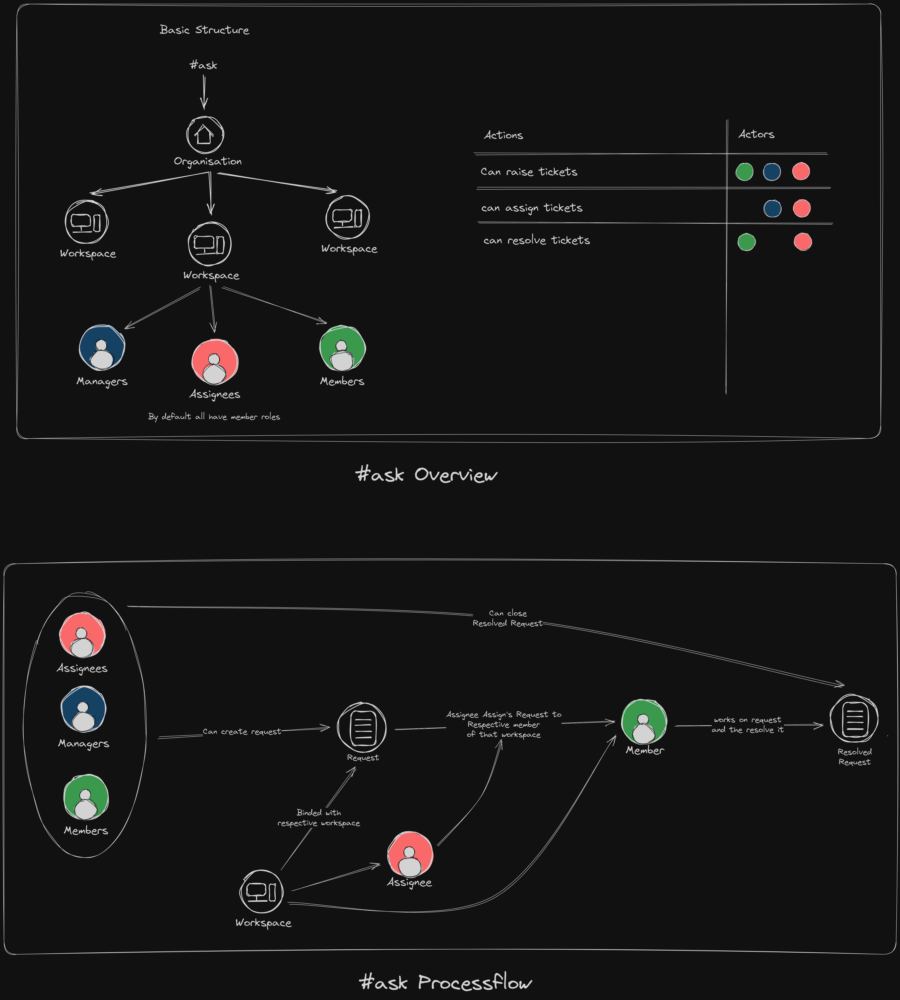

In any organization, there are multiple workspaces, each comprising managers, assignees, and members.

Here, anyone can raise a valid ticket to address their issues, directing it to the relevant department. Once a ticket is raised, the assignee within that department is responsible for assigning the task to a team member. Additionally, the manager possesses the authority to assign tasks to any member within the team.

Assignees and members hold the responsibility to resolve the tickets, addressing the issues raised within the workspace. This collaborative approach ensures efficient ticket resolution within the organization.